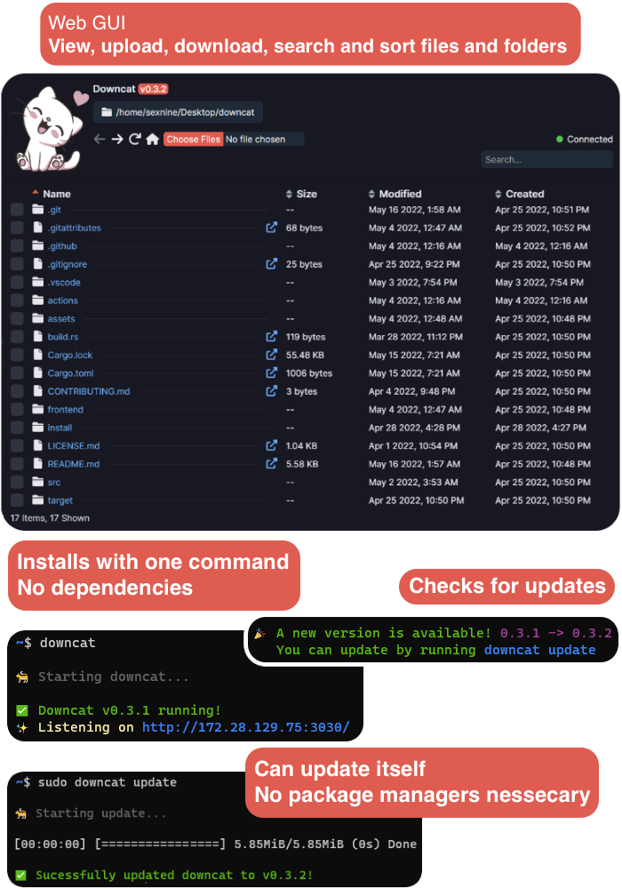

<div align="center">

# Downcat


A simple cross-platform remote file management tool to upload and download files over HTTP/S

[📜 License](LICENSE.md)  |  [✨ Features](#-features) | [🎉 Install](#-install) | [🎁 Releases](https://github.com/sexnine/downcat/releases)
-- | -- | -- | -- 

[](https://www.rust-lang.org/)
[](https://vuejs.org/)
[](https://www.typescriptlang.org/)
[](https://tailwindcss.com/)



</div>

## ✨ Features
⚡ **Fast** - Quick startup, performant API

✨ **Easy to install** - No dependancies, just one command

🗂 **Upload and download files easily** - Using HTTP/S with a sexy web UI

🌈 **Cross platform** - Windows, Linux and MacOS support

## 🎉 Install

### Automated install (Linux only)

###### ⚠ You should not run scripts off the internet without checking them first.  You can view the install script [here](install/downcat_linux.sh).

You can run an automated install of downcat using the command below.  It is highly recommended you run it as root to avoid any permissions-related problems.

```sh
curl -sSL https://raw.githubusercontent.com/sexnine/downcat/main/install/downcat_linux.sh | sudo bash
```

### Manual install

1. Download the latest binary from [the releases tab](https://github.com/sexnine/downcat/releases)
2. Place it into your path
3. Make it executable
4. Run with `downcat`

## 🤔 Usage

Run downcat to serve your current directory and then open the link in your browser

<pre><samp>~$ <kbd>downcat</kbd>
🐈 Starting downcat...

✅ Downcat v0.3.2 running!
✨ Listening on http://192.168.0.23:3030/
</samp></pre>

See extra options by viewing the help with `downcat -h` or `downcat --help`

You can update downcat to the latest available version using `downcat update`

Downcat is not meant to be used as a web server.  It is meant to be used as a quick and easy file management utility for when you quickly need to up/download a file from a server.

### 💎 All options
| Argument | Description | Default Value |
|    --    |     ---     |      ---      |
| `-h, --help` | Shows help message |
| `-V, --version` | Shows version |
| `--disable-update-check` | Disables update check on startup | Check for updates |
| `-p, --port <port>` | Port to listen on | `3030` |
| `--ssl` | Enables SSL (Recommended) | Off |
| `-P, --password <password>` | Sets a password for accessing downcat and the APIs (Recommended). <br> Will need to reauthenticate when restarting downcat, even when using the same password. | None |
| `-b, --bind <host>` | The IP to listen on | Local IP (or `0.0.0.0` if couldn't get local IP) |


## 🛠 Development

<div align="right">

📜 **Prerequisites** |
 -- |
[NodeJS](https://nodejs.org/) & NPM
[Rust](https://www.rust-lang.org/tools/install) & Cargo

</div>

- Clone the repo `git clone https://github.com/sexnine/downcat.git`
- Go into the project's directory `cd downcat/`
  
### ⚙ Installing Dependancies
- Go into the frontend directory `cd frontend/`
- Install NPM dependancies with `npm i`
- Rust dependencies will automatically install when building or running the project with `cargo build` & `cargo run` respectively.

### ▶ Running

#### Frontend
- Go into the frontend directory `cd frontend/`
- Run the dev server with `npm run dev`.  The dev server supports hot reloading.
- Modify the API endpoint in `.env.development` if you need to.

Note: While developing, the frontend and backend should be run seperately.  When building a release version, the frontend's files will be embedded into the rust binary.

#### Backend
- Simply run with `cargo run` in the project root.

### 🏗 Building
1. Build the frontend
   1. Go into the frontend directory `cd frontend/`
   2. Install dependancies if you haven't already with `npm i`
   3. Build the frontend with `npm run build`
2. Build using `cargo build --release`

## 🛣 Roadmap
- [x] Retrieve Files and Folders `v0.1.0`
  - [x] Get metadata `v0.1.0`
  - [x] Sort file list `v0.1.0`
  - [x] Search file list `v0.3.2`
  - [ ] Enhanced File Icons
  - [ ] Download multiple files
  - [x] Directory History `v0.1.0`
- [x] Uploading Files `v0.3.0`
  - [x] Uploading multiple files `v0.3.2`
  - [ ] Uploading Folders
- [ ] Managing Files/Folders
  - [ ] Renaming
  - [ ] Deleting
  - [ ] Moving
  - [ ] Copying
- [x] SSL `v0.2.0`
  - Optionally enable SSL using `--ssl` flag
- [x] Password Authentication `v0.1.0`
- [x] Updater `v0.2.0`
  - [x] Checks for updates `v0.2.0`
  - [x] `downcat update` to perform a self-update `v0.2.0`
- [x] Cross Platform support
  - [x] Windows
  - [x] Linux
  - [x] MacOS `v0.3.1`
- [ ] Allow downcat to access any directory
  - With the `--any` flag, downcat will be able to access any directory or files it has permissions to

## ❤ Acknowledgements
- [@sc0tfree](https://github.com/sc0tfree) for the original inspiration for this project ([updog](https://github.com/sc0tfree/updog))
- [@jethr0-1](https://github.com/jethr0-1) (jethro#1547 on Discord) for making a Linux install script for downcat

<div align="center">

  **Made with 💖 by sexnine**

</div>
